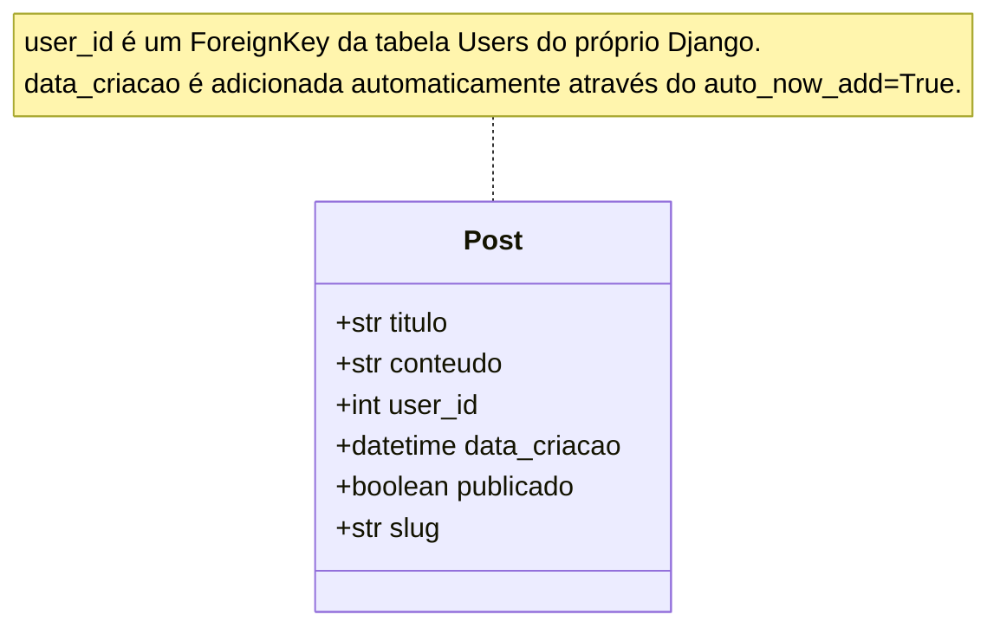
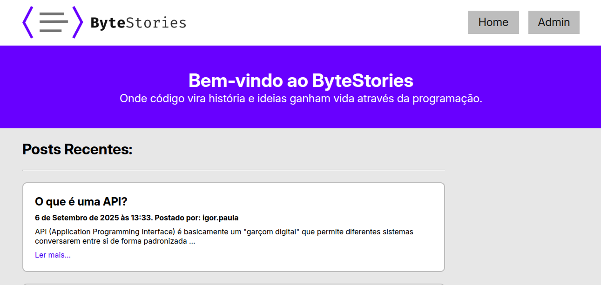
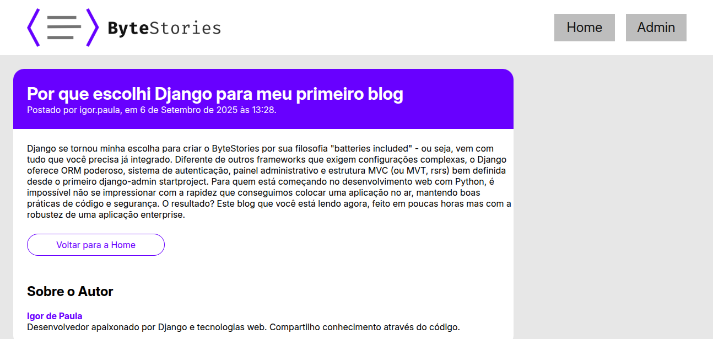
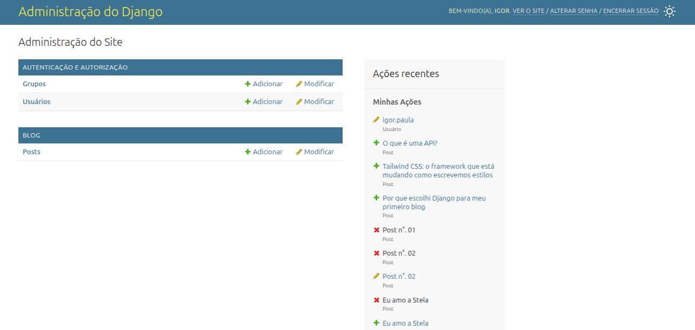

# Blog Django 

Sistema de blog desenvolvido com o Framework Django.

## Requisitos

### Pré-requisitos
- Python 3.3+
- pip (gerenciador de pacotes Python)
- Git

### Dependências do Projeto
```
asgiref==3.9.1
Django==5.2.5
sqlparse==0.5.3
```

## Diagrama de Classes



## Instalação e Configuração

### 1. Clone o Repositório
```bash
git clone https://github.com/igorpaula7/blog-django.git

cd blog-django
```

### 2. Crie um Ambiente Virtual
```bash
# Windows
python -m venv venv
venv\Scripts\activate

# macOS/Linux
python3 -m venv venv
source venv/bin/activate
```

### 3. Instale as Dependências
```bash
pip install -r requirements.txt
```

### 4. Configure o Banco de Dados
```bash
python manage.py makemigrations
python manage.py migrate
```

### 5. Crie um Superusuário
```bash
python manage.py createsuperuser
```

### 6. Execute o Servidor
```bash
python manage.py runserver
```

O projeto estará disponível em: `localhost:8000/`

## Passo a Passo para Utilização

### Para Administradores

#### 1. Acesse o Painel Administrativo
- URL: `localhost:8000/admin/`
- Faça login com suas credenciais de superusuário

#### 2. Criar um Novo Post
1. No painel admin, clique em **"Posts"**
2. Clique em **"Adicionar Post"**
3. Preencha os campos:
   - **Título**: Título do seu post
   - **Conteúdo**: Texto completo do artigo
   - **Autor**: Selecione o autor
   - **Publicado**: Marque para tornar visível, caso deseje manter como rascunho basta deixar desmarcado.
   - **Slug**: URL amigável
4. Clique em **"Salvar"**

#### 3. Gerenciar Posts Existentes
- **Editar**: Clique no título do post na listagem
- **Publicar/Despublicar**: Altere o campo "Publicado"
- **Excluir**: Use as ações em lote ou botão individual

### Para Visitantes

#### 1. Navegar pelo Blog
- **Home**: `localhost:8000/` - Lista todos os posts publicados
- **Post Individual**: Clique em "Ler mais..." em qualquer post

## Funcionalidades


### Possíveis Melhorias Futuras
- [ ] Sistema de comentários
- [ ] Categorias e tags
- [ ] Busca por conteúdo
- [ ] Sistema de likes/favoritos
- [ ] Sistema de usuários público

## Estrutura do Projeto

```
blog-django/
├── blog/
│   ├── models.py          # Modelo Post
│   ├── views.py           # Class Based Views
│   ├── urls.py            # Rotas do blog
│   ├── static/blog/       # CSS e assets
│   │   ├── css/
│   │   └── img/
│   └── templates/         # Templates HTML
├── templates/includes/    # Includes
├── manage.py
└── requirements.txt
```

## Tecnologias Utilizadas

- **Backend**: Django 5.2.5
- **Banco de Dados**: SQLite (desenvolvimento)
- **Frontend**: HTML5, CSS3
- **Fontes**: Google Fonts (Inter)
- **Padrão**: Class-Based Views (CBV)
---

## Capturas de Tela



